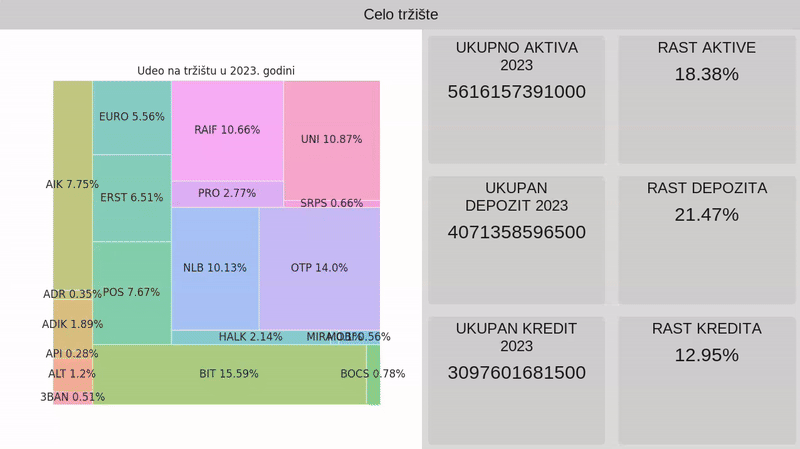

# Banke-RS - Tool for analyzing the banking market

A tool for analyzing the banking market and individual bank performance developed as part of the Computational Finance seminar in Petnica in 2024.

 * See [Usage](#usage) for guidance on how to use this repository.
 * See [Example](#example) for an example of the program.

# Capabilities

The program scrapes data from the NBS (National Bank of Serbia) website for individual bank balance sheets and income statements for the years 2022 and 2023.
This data is parsed, analyzed, and visualized in the program. Banks are clustered using k-means and PCA.

Data shown for the whole market: 
* TOTAL ASSETS 2023, ASSET GROWTH, TOTAL DEPOSIT 2023, DEPOSIT GROWTH, TOTAL LOAN 2023, LOAN GROWTH

Data shown for individual banks: 
* RANK BY ASSETS, TOTAL ASSETS, NET INTEREST MARGIN, RETURN ON EQUITY, LIQUIDITY RATIO, IMPAIRMENT RATE

# Example

# Usage

Prerequisites:
 * Install the packages in [requirements.txt](requirements.txt) with 'pip install -r ./requirements.txt'.

To get started with the program:

 * Run [gui.py](gui.py) with 'python ./gui.py'.

Note: Running the program for the first time might take a while because it must download and analyze data.

